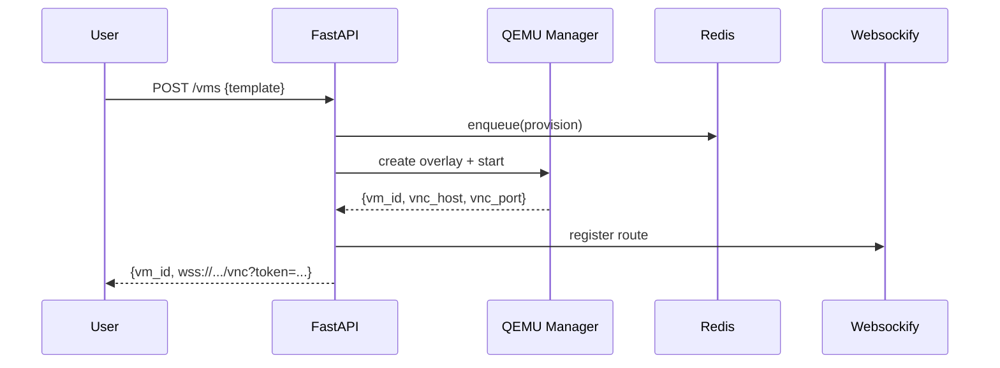

## ARCHITECTURE.md

### 1. Components

* **API service (FastAPI):** REST endpoints + background workers for VM lifecycle.
* **VM Manager:** Thin layer around QEMU/QMP to create, start, stop, snapshot, and destroy VMs.
* **noVNC/Websockify:** WebSocket proxy from browser to VM VNC server.
* **Storage:** qcow2 base images with per‑user overlay chains.
* **Nginx:** TLS termination, path routing (`/api`, `/vnc`, static files), rate limits.
* **Postgres & Redis:** Auth/metadata in Postgres; queue/state in Redis.
* **Prometheus:** Metrics scrape from FastAPI and node exporters.

### 2. VM lifecycle (desired → actual)

1. **Request**: user hits `POST /vms` with template ID and options.
2. **Admission**: check per‑user quota, template availability.
3. **Provision**: create overlay, define QEMU args, allocate ports/netns.
4. **Start**: spawn QEMU, attach VNC, register state in Redis.
5. **Connect**: return `vnc_url` (proxied via Nginx → Websockify).
6. **Reconcile**: controller loop ensures running VMs match desired state.
7. **Stop/Destroy**: graceful shutdown via QMP; cleanup overlay/network.

### 3. Storage model

* **Base images**: Alpine, Tiny Core (read‑only).
* **Overlays**: `qcow2` with `backing_file` pointing to base; per‑VM path schema:

  * `/var/vms/base/alpine-base.qcow2`
  * `/var/vms/users/<uid>/<vm_id>.qcow2`
* **Snapshots**: TODO policy (retain N, expiration, GC).

### 4. Networking

* VNC exposed only to Websockify on localhost/netns.
* Optional: `netns` per VM, `tap` + `bridge` + ebtables/iptables.
* Nginx routes: `/api` → FastAPI, `/vnc` → Websockify.

### 5. Security posture (summary)

* JWT in cookies (`HttpOnly`, `Secure`, `SameSite=Strict/Lax`).
* CSRF protection on state‑changing endpoints.
* Rate limits per IP/user.
* QEMU under unprivileged user + seccomp/AppArmor.
* Secrets via env/manager; rotation schedule.

---