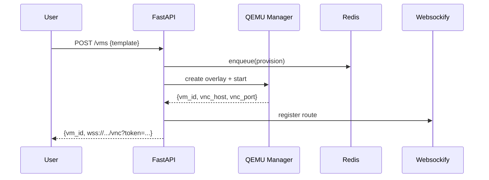

# Cloud VM Platform — Documentation Starter

A practical, fill‑in‑the‑blanks documentation kit tailored to your stack (FastAPI, Postgres, Redis, QEMU, noVNC/Websockify, Nginx, Docker, Prometheus).

---

## Table of Contents

* Overview (`README.md`)
* Architecture (`ARCHITECTURE.md`)
* API Reference (`API.md`)
* Operations & Runbook (`OPERATIONS.md`)
* Security & Threat Model (`SECURITY.md`)
* Deployment (`DEPLOYMENT.md`)
* Testing & QA (`TESTING.md`)
* Observability (`OBSERVABILITY.md`)
* Roadmap (`ROADMAP.md`)
* Contributing (`CONTRIBUTING.md`)
* Glossary (`GLOSSARY.md`)

> You can copy each section into individual files under a `/docs` folder or keep them together. Search for **TODO** to fill in project‑specific bits quickly.

---

```text
/docs
  README.md
  ARCHITECTURE.md
  API.md
  OPERATIONS.md
  SECURITY.md
  DEPLOYMENT.md
  TESTING.md
  OBSERVABILITY.md
  ROADMAP.md
  CONTRIBUTING.md
  GLOSSARY.md
```

---

## README.md (Overview)

**Project name:** TODO

**One‑liner:** Self‑hosted, browser‑based VMs via QEMU streamed with noVNC, orchestrated by FastAPI.

**Key features**

* On‑demand VM overlays (qcow2 backing images) for lightweight provisioning.
* Web access via noVNC (WebSocket proxy) with Nginx in front.
* Auth: email verification, login/password in Postgres, JWT in cookies.
* Per‑user VM quotas; Redis‑backed lifecycle management.
* CI/CD, Dockerized services, Prometheus metrics.

**Tech stack**

* Backend: Python 3 + FastAPI
* Frontend: Basic HTML + Tailwind (TODO update if changed)
* Virtualization: QEMU, noVNC, Websockify
* Storage: qcow2 base images + overlays
* Data stores: Postgres, Redis
* Edge: Nginx
* Telemetry: Prometheus (+ Grafana optional)

**Quick start**

```bash
# 1) Clone
# 2) Copy env template
cp .env.example .env  # TODO fill secrets
# 3) Launch
docker compose up -d  # TODO include compose file
# 4) Open
open http://localhost:8080  # TODO actual port
```

**High‑level diagram**

```mermaid
graph LR
  A[Browser (noVNC client)] -- WebSocket --> B[Nginx]
  B -- /api --> C[FastAPI]
  B -- /vnc --> D[Websockify]
  C -- SQL --> E[(Postgres)]
  C -- KV/Queue --> F[(Redis)]
  C -- QMP/CLI --> G[QEMU VM Manager]
  G -- VNC --> D
  C -- /metrics --> H[Prometheus]
  G -- Images --> I[(qcow2 base+overlays)]
```

**Status badges**

* Build: TODO (CI link)
* Coverage: TODO
* Docker image: TODO

---

## ARCHITECTURE.md

### 1. Components

* **API service (FastAPI):** REST endpoints + background workers for VM lifecycle.
* **VM Manager:** Thin layer around QEMU/QMP to create, start, stop, snapshot, and destroy VMs.
* **noVNC/Websockify:** WebSocket proxy from browser to VM VNC server.
* **Storage:** qcow2 base images with per‑user overlay chains.
* **Nginx:** TLS termination, path routing (`/api`, `/vnc`, static files), rate limits.
* **Postgres & Redis:** Auth/metadata in Postgres; queue/state in Redis.
* **Prometheus:** Metrics scrape from FastAPI and node exporters.

### 2. VM lifecycle (desired → actual)

1. **Request**: user hits `POST /vms` with template ID and options.
2. **Admission**: check per‑user quota, template availability.
3. **Provision**: create overlay, define QEMU args, allocate ports/netns.
4. **Start**: spawn QEMU, attach VNC, register state in Redis.
5. **Connect**: return `vnc_url` (proxied via Nginx → Websockify).
6. **Reconcile**: controller loop ensures running VMs match desired state.
7. **Stop/Destroy**: graceful shutdown via QMP; cleanup overlay/network.



### 3. Storage model

* **Base images**: Alpine, Tiny Core (read‑only).
* **Overlays**: `qcow2` with `backing_file` pointing to base; per‑VM path schema:

  * `/var/vms/base/alpine-base.qcow2`
  * `/var/vms/users/<uid>/<vm_id>.qcow2`
* **Snapshots**: TODO policy (retain N, expiration, GC).

### 4. Networking

* VNC exposed only to Websockify on localhost/netns.
* Optional: `netns` per VM, `tap` + `bridge` + ebtables/iptables.
* Nginx routes: `/api` → FastAPI, `/vnc` → Websockify.

### 5. Security posture (summary)

* JWT in cookies (`HttpOnly`, `Secure`, `SameSite=Strict/Lax`).
* CSRF protection on state‑changing endpoints.
* Rate limits per IP/user.
* QEMU under unprivileged user + seccomp/AppArmor.
* Secrets via env/manager; rotation schedule.

---

## API.md

> Your FastAPI auto‑docs provide schemas; this section fixes stable paths and shows real examples.

### Auth

* `POST /auth/signup` — create account (email verification flow).
* `POST /auth/login` — set JWT cookie.
* `POST /auth/logout` — clear cookie.

### Users/Quotas

* `GET /me` — profile + quotas.
* `GET /me/vms` — list my VMs.

### VM Lifecycle

* `POST /vms` — create/provision a VM.
* `GET /vms/{id}` — details/status.
* `POST /vms/{id}/start` — start if stopped.
* `POST /vms/{id}/stop` — graceful shutdown.
* `DELETE /vms/{id}` — destroy + cleanup.

### Console

* `GET /vms/{id}/console` — returns signed URL for noVNC path.

### Example: Create VM

```http
POST /vms HTTP/1.1
Content-Type: application/json

{
  "template": "alpine-3.19",
  "cpu": 1,
  "memory_mb": 512,
  "disk_gb": 4,
  "userdata": null
}
```

**201 Created**

```json
{
  "vm_id": "vm_01H...",
  "state": "starting",
  "vnc_url": "wss://host/vnc?token=..."
}
```

---

## OPERATIONS.md (Runbook)

### Service layout

* **Processes/containers**: nginx, api, worker, websockify, postgres, redis, prometheus.
* **Ports**: TODO list

### Common procedures

* **Deploy**: `git push main` → CI → Docker build → Compose update (TODO details).
* **Rotate secrets**: TODO cadence and steps.
* **Create base image**: script path + example.
* **Restore from backup**: Postgres dump, base image store, VM overlays.
* **Handle stuck VM**:

  1. Check QMP health.
  2. Attempt graceful shutdown.
  3. Force kill QEMU PID.
  4. Clean artifacts (tap device, overlay lockfiles).

### SLOs & Alerts (targets)

* VM boot success ≥ **99.0%** over 7d.
* P95 time to console < **20s**.
* API error rate < **1%**.

---

## SECURITY.md

### Goals

Protect the host, tenants, data, and the network while enabling browser VM access.

### Controls (checklist)

* [ ] Password hashing: **Argon2id** with sane params.
* [ ] JWT cookie flags: `HttpOnly`, `Secure`, `SameSite`.
* [ ] CSRF: double‑submit token or SameSite+CSRF header on unsafe methods.
* [ ] Rate limiting & login throttling.
* [ ] QEMU confinement: run as unprivileged user; AppArmor/SELinux profile; `-sandbox on` where possible.
* [ ] Network isolation: per‑VM netns/bridge; block privileged traffic.
* [ ] Secrets management & rotation.
* [ ] Dependency updates & image scanning.

### Threat model (STRIDE summary)

* **Spoofing**: session hijack → cookie flags, TLS, CSRF, IP pinning (optional).
* **Tampering**: VM image tamper → verify checksums, RO base images.
* **Repudiation**: audit logs with user/VM actions.
* **Information disclosure**: noVNC leakage → scoped tokens, short TTL URLs.
* **DoS**: quotas, cgroup limits, rate limits.
* **Elevation**: QEMU escape → hardening + timely patches.

---

## DEPLOYMENT.md

### Environments

* **Local dev**, **Staging**, **Prod** — TODO define differences.

### Configuration

* `.env` keys: `POSTGRES_URL`, `REDIS_URL`, `JWT_SECRET`, `SMTP_*`, `VNC_PUBLIC_URL`, etc. (TODO finalize list)

### Nginx routing snippet (example)

```nginx
location /api/ { proxy_pass http://api:8000/; proxy_set_header Upgrade $http_upgrade; proxy_set_header Connection $connection_upgrade; }
location /vnc/ { proxy_pass http://websockify:6080/; proxy_http_version 1.1; proxy_set_header Upgrade $http_upgrade; proxy_set_header Connection $connection_upgrade; }
```

### Docker Compose (outline)

```yaml
services:
  api:
    image: TODO/your-api
    env_file: .env
    ports: ["8000:8000"]
    depends_on: [postgres, redis]
  websockify:
    image: TODO/websockify
  nginx:
    image: nginx
    ports: ["80:80", "443:443"]
```

---

## TESTING.md

### Pyramid

* **Unit**: business logic (quota checks, token utils).
* **API**: pytest + httpx; schema/contract tests.
* **E2E**: spin a VM, reach console URL, assert OK.
* **Load**: Locust/k6 for VM create/connect rate.

### Test data

* Seed users, templates, quotas (fixtures).

### CI gates

* Lint, type‑check (mypy), tests, image build, Trivy scan, deploy.

---

## OBSERVABILITY.md

### Metrics (suggested)

* `vm_provision_duration_seconds` (histogram)
* `vm_boot_success_total` / `_failure_total`
* `controller_reconcile_duration_seconds`
* `websockify_active_sessions`
* `api_requests_total` / `_duration_seconds`
* `db_query_duration_seconds`
* `queue_depth`

### Logs

* JSON logs with request IDs; correlation across API/worker.

### Traces

* OpenTelemetry for key flows: Create VM → Console.

---

## ROADMAP.md

**0–2 weeks**

* Harden cookies + CSRF + rate limiting.
* Basic reconciler loop with retries; QMP health checks.
* Architecture diagram + README polish.

**2–6 weeks**

* Per‑VM netns + firewall; secrets rotation.
* Snapshot/backup/GC policy; user‑data injection.
* Grafana dashboards + alerts.

**Stretch**

* Template library; autoscaling workers; optional billing/metering.

---

## CONTRIBUTING.md

* Dev setup: Python version, `poetry`/`pip`, `pre-commit` hooks.
* Branching model & commit style.
* Code style: black, isort, ruff; mypy.
* PR checklist and review rules.

---

## GLOSSARY.md

* **QMP**: QEMU Machine Protocol, JSON control channel.
* **qcow2 overlay**: Copy‑on‑write layer referencing a base image.
* **noVNC**: Browser VNC client over WebSockets.
* **Websockify**: TCP↔WebSocket proxy used by noVNC.
* **Reconciler**: Loop that makes actual state converge to desired state.
* **SLO**: Service Level Objective; target reliability metric.

---

### Fill‑in Checklist

* [ ] Replace all **TODOs**.
* [ ] Paste real ports, env keys, and CI/CD steps.
* [ ] Insert your actual docker‑compose and Nginx files.
* [ ] Add screenshots/GIF of VM boot + console.
* [ ] Link to demo and Grafana dashboards.
